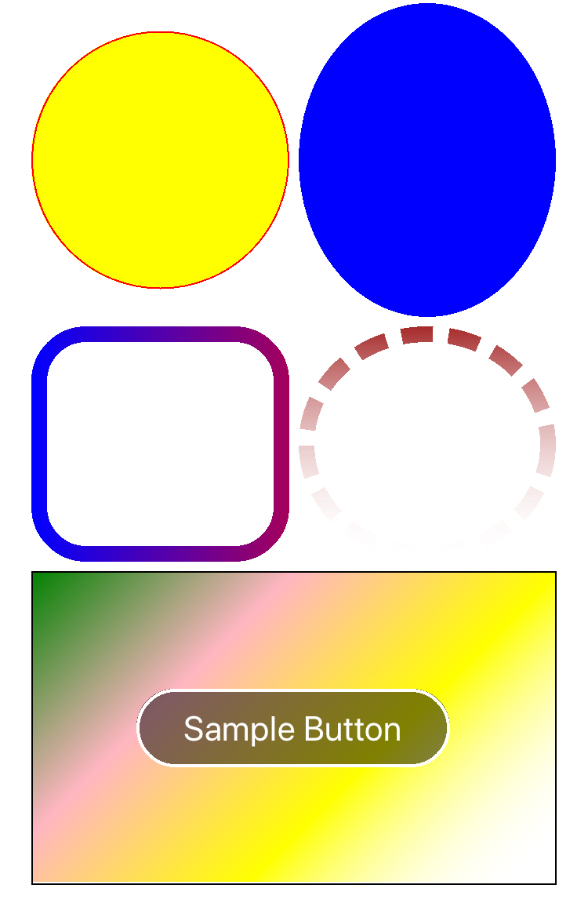

# ShapeControl.Forms



Xamarin.Forms(.Net Standard) library that allows you to draw shapes such as circle, roundrect, oval and so on.

Supports Android, iOS and Unified Windows Platform (UWP, UAP).

This is based on [SkiaSharp.Views.Forms](https://www.nuget.org/packages/SkiaSharp.Views.Forms).

[](https://www.nuget.org/packages/ShapeControl.Forms/)

## Features

* Circle
* Oval
* RoundedRect
* Effects by using [SkiaSharp library](https://www.nuget.org/packages/SkiaSharp.Views.Forms).

## Support Platforms

* iOS 8+
* Android
* Universal Windows Platform (Win10/UWP)

## Usage

### Setup

* Install [SkiaSharp.Views.Forms](https://www.nuget.org/packages/SkiaSharp.Views.Forms) in each of your platforms.
* Install the [nuget package](https://www.nuget.org/packages/ShapeControl.Forms/) in only Portable project.
* Please refer [test XAML](Test/Test/MainPage.xaml)

### Circle Example

```
    <shapes:Circle>
        <shapes:Circle.Paint>
            <shapes:SSPaint BorderWidth="1" 
                            BorderColor="Red"
                            FillColor="Yellow"
                            />
        </shapes:Circle.Paint>
    </shapes:Circle>
```

### Oval with Blue Solid Color

```
    <shapes:Oval>
        <shapes:Oval.Paint>
            <shapes:SSPaint FillColor="Blue"
                            />
        </shapes:Oval.Paint>
    </shapes:Oval>
```

### RoundRect with Gridient Color

```
    <shapes:RoundRect RadiusX="30"
                      RadiusY="30"
                      >
        <shapes:RoundRect.Paint>
            <shapes:SSPaint BorderWidth="10"
                            FillColor="Transparent"
                            >
                <shapes:SSPaint.BorderShader>
                    <skiaSharp:SKShader x:FactoryMethod="CreateLinearGradient"
                                        >
                        <x:Arguments>
                            <skiaSharp:SKPoint>
                                <x:Arguments>
                                    <x:Single>0</x:Single>
                                    <x:Single>0</x:Single>
                                </x:Arguments>
                            </skiaSharp:SKPoint>
                            <skiaSharp:SKPoint>
                                <x:Arguments>
                                    <x:Single>255</x:Single>
                                    <x:Single>0</x:Single>
                                </x:Arguments>
                            </skiaSharp:SKPoint>
                            <x:Array Type="{x:Type skiaSharp:SKColor}">
                                <shapes:SKColorMarkup Value="Blue" />
                                <shapes:SKColorMarkup Value="Red" />
                            </x:Array>
                            <x:Array Type="{x:Type x:Single}">
                                <x:Single>0</x:Single>
                                <x:Single>1</x:Single>
                            </x:Array>
                            <skiaSharp:SKShaderTileMode>
                                Clamp
                            </skiaSharp:SKShaderTileMode>
                        </x:Arguments>
                    </skiaSharp:SKShader>                                
                </shapes:SSPaint.BorderShader>
            </shapes:SSPaint>
        </shapes:RoundRect.Paint>
    </shapes:RoundRect>
```

## Contributors

* **[Marko Rothstein](https://www.facebook.com/profile.php?id=100014026622428)**
