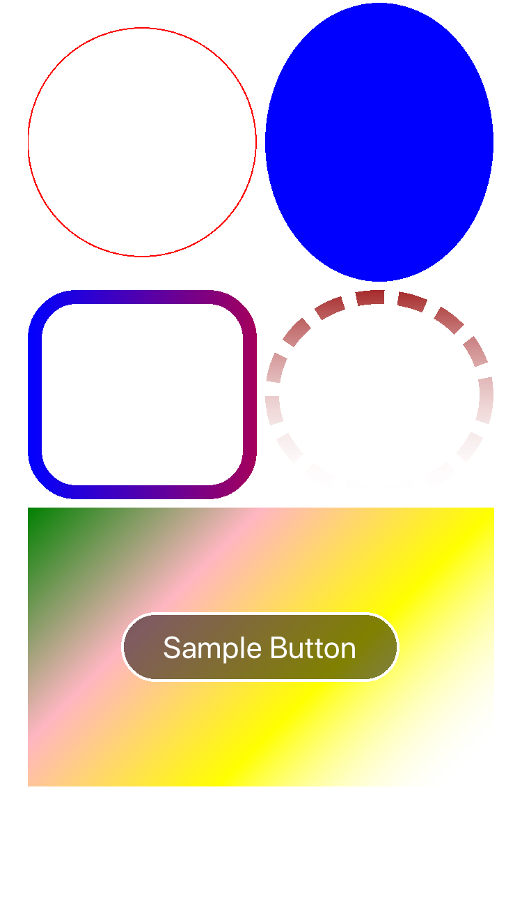

# ShapeControl.Forms

Xamarin.Forms(.Net Standard) library that allows you to draw shapes such as circle, roundrect, oval and so on.
Supports Android, iOS and Unified Windows Platform (UWP, UAP)
This is based on [SkiaSharp.Views.Forms](https://www.nuget.org/packages/SkiaSharp.Views.Forms)

### Features

* Circle
* Oval
* RoundedRect
* Color Effect by using [SkiaSharp library](https://www.nuget.org/packages/SkiaSharp.Views.Forms).

### Support Platforms

* iOS 8+
* Android
* Universal Windows Platform (Win10/UWP)

### ScrenShot



### Usage

#### Setup

* Install [SkiaSharp.Views.Forms](https://www.nuget.org/packages/SkiaSharp.Views.Forms) in each of your platforms.
* Install the [nuget package](https://www.nuget.org/packages/ShapeControl.Forms/) in only Portable project.

#### Circle with Solid Stroke

```
  <StackLayout Orientation="Vertical"
               >
      <shapes:Circle HeightRequest="200"
                     >
          <shapes:Circle.Paint>
              <skiaSharp:SKPaint Style="Stroke"
                                Color="{shapesExtension:SKColorMarkup Red}"
                                StrokeWidth="1"
                                />
          </shapes:Circle.Paint>
      </shapes:Circle>
   </StackLayout>
```

#### Oval with Blue Solid Color

```
  <StackLayout Orientation="Vertical"
    <shapes:Oval HeightRequest="200"
                 >
        <shapes:Oval.Paint>
            <skiaSharp:SKPaint Style="StrokeAndFill"
                              Color="{shapesExtension:SKColorMarkup Blue}"
                              />
        </shapes:Oval.Paint>
    </shapes:Oval>
  </StackLayout>
```

#### RoundRect with Gridient Color

```
  <StackLayout Orientation="Vertical"
      <shapes:RoundRect HeightRequest="200"
                        RadiusX="30"
                        RadiusY="30"
                        >
          <shapes:RoundRect.Paint>
              <skiaSharp:SKPaint Style="Fill"
                                >
                  <skiabskiaSharpase:SKPaint.Shader>
                      <skiaSharp:SKShader x:FactoryMethod="CreateLinearGradient"
                                         x:Name="shader1"
                                         >
                          <x:Arguments>
                              <skiaSharp:SKPoint>
                                  <x:Arguments>
                                      <x:Single>0</x:Single>
                                      <x:Single>0</x:Single>
                                  </x:Arguments>
                              </skiaSharp:SKPoint>
                              <skiaSharp:SKPoint>
                                  <x:Arguments>
                                      <x:Single>255</x:Single>
                                      <x:Single>255</x:Single>
                                  </x:Arguments>
                              </skiaSharp:SKPoint>
                              <x:Array Type="{x:Type skiaSharp:SKColor}">
                                  <shapesExtension:SKColorMarkup Value="Green" />
                                  <shapesExtension:SKColorMarkup Value="Yellow" />
                              </x:Array>
                              <x:Array Type="{x:Type x:Single}">
                                  <x:Single>0</x:Single>
                                  <x:Single>1</x:Single>
                              </x:Array>
                              <skiaSharp:SKShaderTileMode>
                                  Clamp
                              </skiaSharp:SKShaderTileMode>
                          </x:Arguments>
                      </skiaSharp:SKShader>
                  </skiaSharp:SKPaint.Shader>
              </skiaSharp:SKPaint>
          </shapes:RoundRect.Paint>
      </shapes:RoundRect>
  </StackLayout>
```
